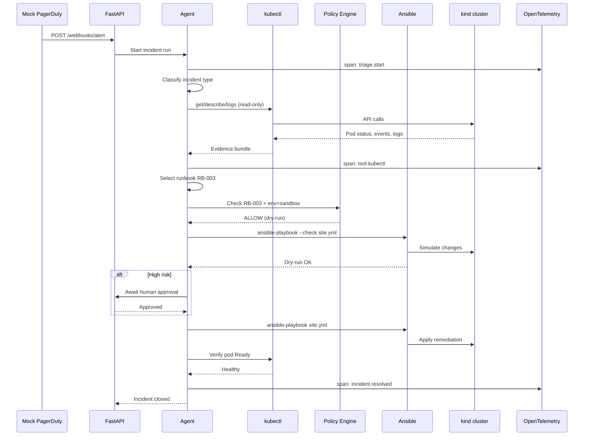
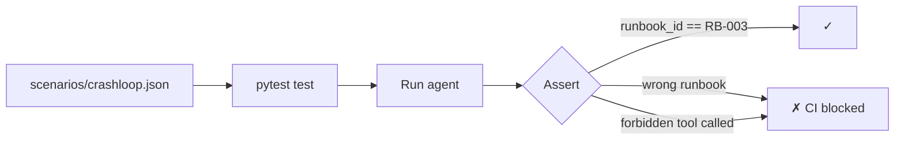
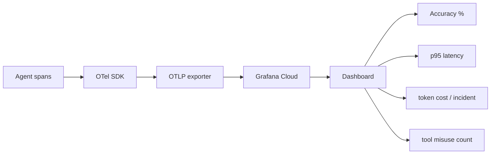

# Data Flow

## End-to-end alert → remediation flow



## Alert payload schema (input)

Mock webhooks mirror real PagerDuty / New Relic shapes:

```json
{
  "id": "inc-001",
  "source": "pagerduty",
  "severity": "critical",
  "summary": "checkout-api CrashLoopBackOff",
  "labels": {
    "cluster": "demo",
    "namespace": "shop",
    "pod": "checkout-api-7d4f8b9c-xk2lm",
    "alertname": "KubePodCrashLooping"
  },
  "timestamp": "2026-05-21T14:30:00Z"
}
```

## Agent output schema (structured)

```json
{
  "incident_id": "inc-001",
  "incident_type": "CrashLoopBackOff",
  "root_cause": "Container OOMKilled — memory limit 128Mi too low",
  "confidence": 0.92,
  "recommended_runbook_id": "RB-003",
  "evidence": [
    "kubectl describe: Last State OOMKilled",
    "kubectl logs: java.lang.OutOfMemoryError"
  ],
  "proposed_action": "Increase memory limit and restart deployment",
  "risk_level": "medium"
}
```

## Runbook catalog entry (YAML)

```yaml
runbooks:
  - id: RB-003
    name: Fix OOM — scale memory and restart
    incident_types:
      - CrashLoopBackOff
      - OOMKilled
    playbook: runbooks/playbooks/fix-oom.yml
    risk_level: medium
    allowed_envs:
      - sandbox
    requires_approval: true
    allowed_tools:
      - ansible-playbook
    forbidden_actions:
      - delete namespace
      - delete pvc
```

## Eval fixture flow



Each golden scenario defines:

| Field | Purpose |
|-------|---------|
| `input` | Alert JSON fixture |
| `expected_runbook_id` | Correct remediation |
| `forbidden_tools` | Tools that must never be invoked |
| `min_confidence` | Optional threshold |

## Observability data flow


