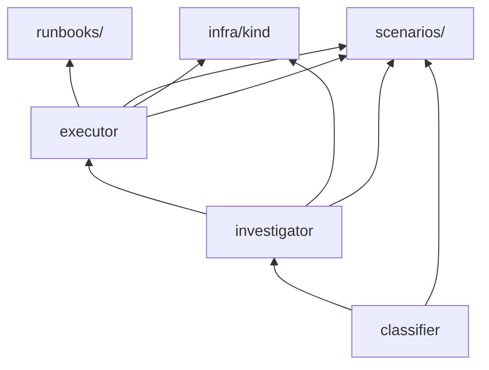

# Monorepo Layout

## Directory structure

```
runbook-agent/
├── README.md
├── LICENSE
├── Makefile                    # make demo | eval | cluster-up
├── .github/
│   └── workflows/
│       ├── deploy-docs.yml     # GitHub Pages (Docusaurus)
│       └── ci.yml              # Python evals (Phase 1+)
├── website/                    # Docusaurus docs (this site)
│   ├── docs/
│   ├── src/
│   └── docusaurus.config.ts
├── packages/
│   ├── classifier/             # Phase 1 — alert classification
│   │   ├── pyproject.toml
│   │   ├── src/classifier/
│   │   └── tests/
│   ├── investigator/           # Phase 2 — read-only investigation
│   │   ├── pyproject.toml
│   │   ├── src/investigator/
│   │   └── tests/
│   └── executor/               # Phase 3 — policy + Ansible execution
│       ├── pyproject.toml
│       ├── src/executor/
│       └── tests/
├── runbooks/
│   ├── catalog.yaml            # Approved runbook definitions
│   └── playbooks/              # Ansible playbooks
├── scenarios/                  # Golden incident fixtures
│   ├── crashloop.json
│   ├── oomkill.json
│   └── bad-configmap.json
├── infra/
│   ├── kind/
│   │   └── kind-config.yaml
│   └── k8s/                    # Demo broken workloads (plain YAML v1)
├── otel/
│   └── collector-config.yaml
└── platform/                   # Phase 4 — eval dashboard, MCP (future)
```

## Package dependency graph



| Package | Depends on | Exposes |
|---------|------------|---------|
| `classifier` | LLM API, Pydantic | `classify(alert) → ClassificationResult` |
| `investigator` | `classifier`, kubectl tools | `investigate(alert) → InvestigationResult` |
| `executor` | `investigator`, Ansible, policy | `remediate(incident) → RemediationResult` |

## Makefile targets (planned)

```bash
make help          # Show all targets
make cluster-up    # Create kind cluster + deploy broken apps
make cluster-down  # Tear down kind cluster
make demo          # Full demo: alert → investigate → fix
make eval          # Run golden scenario evals
make test          # Run all pytest suites
make docs          # Start Docusaurus dev server
make docs-build    # Build docs for production
```

## Branching strategy

| Branch | Purpose |
|--------|---------|
| `main` | Stable docs + released phases |
| `phase-1/classifier` | Phase 1 development |
| `phase-2/investigator` | Phase 2 development |
| `phase-3/executor` | Phase 3 development |

Feature branches merge to phase branches first, then to `main` when eval gates pass.
