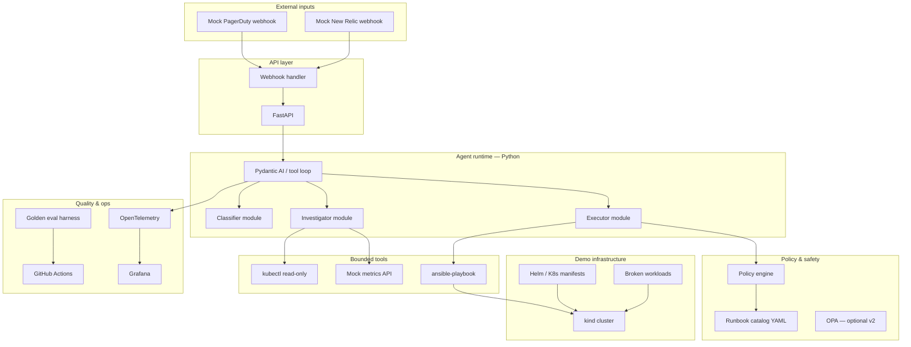
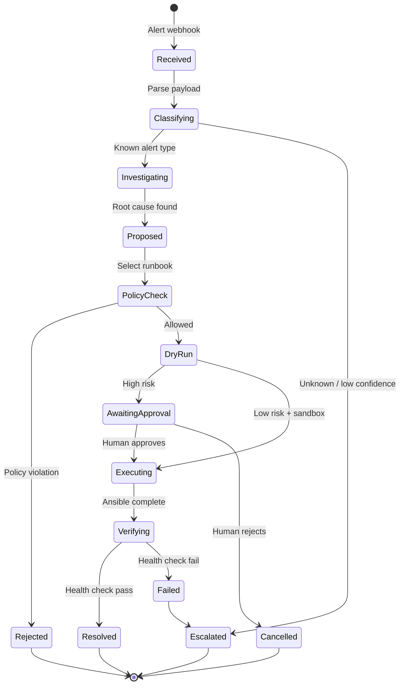
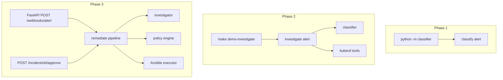

# System Design

## High-level architecture



## Component responsibilities

| Component | Package | Responsibility |
|-----------|---------|----------------|
| **Webhook API** | `packages/executor` | Receive alerts, return incident ID, trigger agent run |
| **Classifier** | `packages/classifier` | Map alert JSON → incident type + runbook ID (Phase 1) |
| **Investigator** | `packages/investigator` | Multi-step tool loop: kubectl + metrics → root cause (Phase 2) |
| **Executor** | `packages/executor` | Policy check → Ansible dry-run → approve → execute (Phase 3) |
| **Runbook catalog** | `runbooks/catalog.yaml` | Approved remediations, risk tiers, allowed environments |
| **Policy engine** | `packages/executor/policy` | Block forbidden tools, env mismatches, high-risk without approval |
| **Demo cluster** | `infra/kind` | Local K8s with intentional failure modes |
| **Eval harness** | `scenarios/` | Golden fixtures + pytest assertions |

## Incident lifecycle



## Design principles

1. **Structured outputs only** — agent returns JSON schemas, never free-form shell
2. **Tools are allowlisted** — middleware rejects anything outside the catalog
3. **Dry-run by default** — Ansible `--check` unless explicitly approved
4. **Evals are merge gates** — wrong runbook = failed CI
5. **Observability is not optional** — every tool call gets an OTel span

## Deployment targets

| Environment | Purpose | Phase |
|-------------|---------|-------|
| **Local (kind)** | Development + demo | Phase 2+ |
| **GitHub Actions** | CI eval runs | Phase 1+ |
| **GCP Cloud Run** | Optional cloud demo | Phase 4 |

Local-first keeps cost at ~$5–20/month (LLM API only during development).

## Runtime orchestration (by phase)

Each phase adds an entrypoint. Packages chain via Python imports — no shared orchestrator until Phase 3.



| Phase | Entrypoint | Orchestrator | State storage |
|-------|------------|--------------|---------------|
| **1** | `make eval-classifier` | pytest | Stateless (fixture in → result out) |
| **2** | `make demo-investigate` | CLI in `packages/investigator` | In-memory per run |
| **3** | `make demo` / FastAPI | `packages/executor` | In-memory dict + JSON audit log to stdout |
| **4** | Same as Phase 3 | + platform module | SQLite optional (v2) |

### Shared modules

| Module | Location | Used by |
|--------|----------|---------|
| Pydantic models | Each package exports its own | Downstream imports |
| Policy (read-only) | `packages/investigator/src/policy.py` | Investigator |
| Policy (execution) | `packages/executor/src/policy.py` | Executor — extends read-only rules |
| Runbook catalog | `runbooks/catalog.yaml` | Classifier, investigator, executor |
| Scenarios | `scenarios/*.json` | All eval suites |

No `packages/common` in v1 — extract only if duplication becomes painful in Phase 3.

### Human approval (v1)

Phase 3 uses **API-only approval** — no web UI until v2:

```bash
curl -X POST http://localhost:8000/incidents/inc-001/approve \
  -H "Content-Type: application/json" \
  -d '{"approved_by": "oncall-engineer"}'
```

High and medium risk runbooks in sandbox require approval per [policy guardrails](../security/policy-guardrails#risk-matrix).
