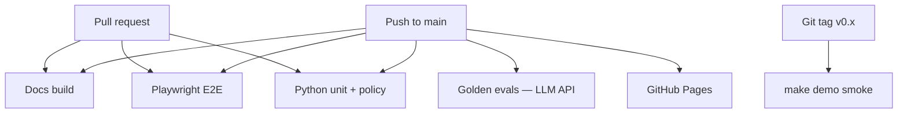

# CI & Secrets

How GitHub Actions runs tests, when LLM API calls happen, and how to configure secrets.

## Pipeline overview



## What runs when

| Trigger | Jobs | LLM API? |
|---------|------|----------|
| **Every PR** | Docs build, Playwright (desktop + mobile + reduced-motion), Python unit/policy | No |
| **Push to `main`** | Above + golden evals + Pages deploy | Yes |
| **Git tag** | Full demo smoke + eval report | Yes |

:::caution Cost control
Golden evals call Anthropic on every `main` push. Do **not** add LLM evals to PR CI unless you add a mock provider for PRs.
:::

## GitHub secrets setup

### Required (Phase 1+)

| Secret | Purpose | Where to get it |
|--------|---------|-----------------|
| `ANTHROPIC_API_KEY` | Golden evals on `main` | [Anthropic Console](https://console.anthropic.com/) → API Keys |

### Setup steps

1. Open **GitHub** → `AsifAd/runbook-agent` → **Settings** → **Secrets and variables** → **Actions**
2. Click **New repository secret**
3. Name: `ANTHROPIC_API_KEY`, Value: your key
4. Push to `main` — eval job should pass (once Phase 1 tests exist)

### Local development

```bash
export ANTHROPIC_API_KEY="sk-ant-..."
make eval-classifier   # Phase 1+
make eval              # Phase 3 full pipeline
```

Never commit keys. `.env` is gitignored.

## Mock LLM for unit tests

Unit and policy tests **must not** call the real API.

| Test type | LLM | Approach |
|-----------|-----|----------|
| Unit | Mock | Inject fake `ClassificationResult` via Pydantic AI test client or dependency override |
| Policy | None | Pure Python — no agent |
| Golden eval | Real API | `pytest packages/*/tests/eval/` on `main` only |
| Integration | Real API or recorded fixtures | Optional VCR cassettes for CI cost reduction (v1.1) |

Example pattern (Phase 1):

```python
# packages/classifier/tests/unit/test_classify.py
def test_parse_result(mock_classifier):
    result = mock_classifier.classify(FIXTURE_ALERT)
    assert result.recommended_runbook_id == "RB-001"
```

## Playwright E2E projects

| Project | Viewport | Purpose |
|---------|----------|---------|
| `chromium` | Desktop 1280×720 | Primary docs + nav |
| `mobile-chromium` | iPhone 13 | Responsive + mobile nav |
| `reduced-motion` | Desktop | `prefers-reduced-motion` |

Run locally:

```bash
cd website
npm run test:e2e
```

## Eval baseline updates

When prompt changes **improve** accuracy:

1. Run `make eval-classifier` locally — confirm new pass rate
2. If intentional improvement, update `expected` in fixtures OR document in eval report
3. Never lower thresholds to make CI green

When prompt changes **regress**:

1. `git revert` the prompt commit
2. Or rollback per [Phase Testing Gates](./phase-testing-gates#phase-1--alert-classifier)

## Planned CI workflow (Phase 1+)

```yaml
# .github/workflows/ci.yml — eval job excerpt
eval:
  runs-on: ubuntu-latest
  if: github.event_name == 'push' && github.ref == 'refs/heads/main'
  env:
    ANTHROPIC_API_KEY: ${{ secrets.ANTHROPIC_API_KEY }}
  steps:
    - uses: actions/checkout@v4
    - uses: actions/setup-python@v5
      with:
        python-version: '3.11'
    - run: pip install -e packages/classifier
    - run: pytest packages/classifier/tests/eval/ --timeout=300
```

## Troubleshooting

| Problem | Fix |
|---------|-----|
| Eval job skipped on PR | Expected — evals run on `main` only |
| `ANTHROPIC_API_KEY` missing | Add secret in repo settings |
| Eval timeout | Reduce fixture count or increase `--timeout` |
| Flaky golden test | Check model version drift; pin model in ADR-001 |

## Related

- [ADR-001: LLM provider](../decisions/llm-provider)
- [Phase testing gates](./phase-testing-gates)
- [Testing strategy](./testing-strategy)
