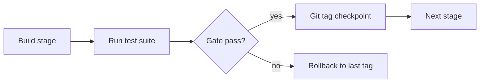
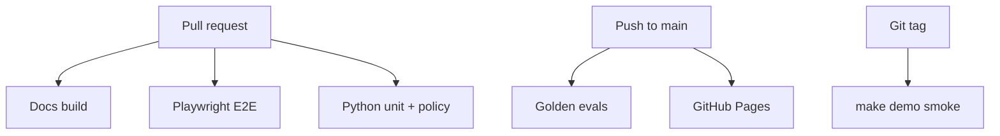

# Phase Testing Gates

Every phase ships with a **defined test suite**, **stage checkpoints**, and **rollback points**. No phase advances until gates pass. This is the same discipline as production releases — applied to agent development.



## Test types (used across all phases)

| Type | Tool | When | Blocks merge? |
|------|------|------|---------------|
| **Unit** | pytest | Every PR | Yes |
| **Policy** | pytest | Every PR | Yes |
| **Golden eval** | pytest + LLM API | `main` push | Yes |
| **Integration** | pytest + kind | Phase 2+ PRs | Yes |
| **E2E demo** | `make demo` + scripts | Pre-tag | Yes |
| **Docs E2E** | Playwright | Every PR (website/) | Yes |
| **Security** | adversarial evals | Phase 2+ | Yes |
| **Manual smoke** | checklist | Pre-tag | Required sign-off |
| **Performance** | OTel metrics / benchmarks | Pre-tag | Warn, not block (v1) |

---

## Phase 0 — Docs & scaffold

**Tag:** `phase-0-complete` (optional) · **Status:** Complete

### Testing

| Test | Command | Coverage |
|------|---------|----------|
| Docs build | `cd website && npm run build` | All MDX/MD, Mermaid, links |
| Docs E2E | `cd website && npm run test:e2e` | Homepage, all doc pages, nav, responsive, theme |
| Link check | Docusaurus `onBrokenLinks: throw` | Internal links |
| CI | GitHub Actions `ci.yml` | Build + E2E on every PR |

### Stage checks

| Stage | Check | Pass criteria |
|-------|-------|---------------|
| S0.1 Repo created | `gh repo view AsifAd/runbook-agent` | Repo public, MIT license |
| S0.2 Docs content | All phase specs present | 18 doc pages build |
| S0.3 GitHub Pages | Deploy workflow green | Site live at `/runbook-agent/` |
| S0.4 E2E suite | Playwright all projects | 0 failures (desktop, tablet, mobile) |
| S0.5 Monorepo layout | Directories exist | `packages/`, `runbooks/`, `scenarios/`, `infra/` |

### Rollback points

| Rollback to | When | How |
|-------------|------|-----|
| `eb608c8` | Docs site broken | `git checkout eb608c8 -- website/` |
| Delete Pages deploy | Workflow misconfigured | Revert `.github/workflows/deploy-docs.yml` |
| Pre-Docusaurus | Wrong docs framework choice | N/A — Phase 0 complete, forward only |

---

## Phase 1 — Alert Classifier

**Tag:** `phase-1-complete` · **Visibility:** Internal

### Testing

| Test | Command | What it validates |
|------|---------|-------------------|
| Unit | `pytest packages/classifier/tests/unit/` | Pydantic models, parsing, confidence logic |
| Golden eval | `make eval-classifier` | Alert → runbook ID accuracy ≥ 90% |
| Schema | `pytest packages/classifier/tests/test_schema.py` | 100% structured JSON parse rate |
| Regression | CI on every PR | No accuracy drop vs baseline |
| Prompt snapshot | manual diff | Prompt changes reviewed in PR |
| Cost check | eval report | &lt; $0.02 per classification |

### Stage checks

| Stage | After | Gate |
|-------|-------|------|
| S1.1 Models + fixtures | Week 1 day 3 | 5 fixtures load; models validate |
| S1.2 Classifier impl | Week 1 day 7 | 3/5 golden pass (baseline) |
| S1.3 Prompt iteration | Week 2 day 3 | ≥ 12/15 golden pass |
| S1.4 CI wired | Week 2 day 5 | GitHub Actions green |
| **S1.5 Phase gate** | Week 2 end | ≥ 14/15 golden; CI green; catalog schema frozen |

### Rollback points

| Rollback to | When | How |
|-------------|------|-----|
| `phase-0-complete` | Classifier approach wrong | `git checkout phase-0-complete -- packages/classifier/` |
| Prompt vN-1 | Accuracy regressed after prompt change | Revert `packages/classifier/src/prompts/` |
| Catalog v1 | Schema breaking change failed | `git checkout HEAD~1 -- runbooks/catalog.yaml` |
| Last green CI | Eval suite broken | `git revert <commit>` — never `--no-verify` |

:::caution Do not advance to Phase 2 if
Golden accuracy &lt; 90%, structured output parse rate &lt; 100%, or runbook catalog schema is still changing.
:::

---

## Phase 2 — Incident Investigator

**Tag:** `v0.1.0` · **Visibility:** Public v0.1

### Testing

| Test | Command | What it validates |
|------|---------|-------------------|
| Unit | `pytest packages/investigator/tests/unit/` | Tool allowlist, policy middleware |
| Policy | `pytest packages/investigator/tests/policy/` | Forbidden tools blocked (0 escapes) |
| Golden eval | `make eval-investigator` | Root cause accuracy ≥ 80% |
| Adversarial | `pytest packages/investigator/tests/adversarial/` | Misleading logs, prompt injection |
| Integration | `pytest packages/investigator/tests/integration/` | kind cluster + kubectl tools |
| E2E demo | `make demo-investigate` | CrashLoop scenario end-to-end |
| OTel | manual + automated | 100% tool call span coverage |
| Docs E2E | `npm run test:e2e` | Docs still pass after code changes |
| Cluster smoke | `make cluster-up && kubectl get pods -n shop` | 3 broken workloads deployed |

### Stage checks

| Stage | After | Gate |
|-------|-------|------|
| S2.1 kind cluster | Week 3 day 3 | `make cluster-up` succeeds; 3 pods unhealthy |
| S2.2 Tool wrapper | Week 3 day 7 | Read-only tools work; write tools rejected |
| S2.3 Agent loop | Week 4 day 3 | CrashLoop scenario finds root cause |
| S2.4 OTel | Week 4 day 5 | Traces exported; dashboard screenshot |
| S2.5 Adversarial | Week 5 day 3 | 3/3 adversarial pass |
| **S2.6 Phase gate** | Week 5 end | `make demo-investigate` pass; tag `v0.1.0` |

### Rollback points

| Rollback to | When | How |
|-------------|------|-----|
| `phase-1-complete` | Investigator design flawed | Remove `packages/investigator/`; keep classifier |
| `v0.1.0-rc1` | Pre-release bug | `git checkout v0.1.0-rc1` |
| kind manifest vN | Cluster broken after manifest change | `kubectl delete -f infra/k8s/ && git checkout HEAD~1 -- infra/k8s/` |
| Tool allowlist | Agent called forbidden tool | Revert `packages/investigator/src/tools/` immediately |
| `make cluster-down` | Local cluster corrupted | `kind delete cluster --name runbook-agent && make cluster-up` |

---

## Phase 3 — Runbook Agent (capstone)

**Tag:** `v1.0.0` · **Visibility:** Portfolio featured

### Testing

| Test | Command | What it validates |
|------|---------|-------------------|
| Unit | `pytest packages/executor/tests/unit/` | Policy engine, catalog lookup |
| Policy | `pytest packages/executor/tests/policy/` | Risk matrix, env checks, forbidden actions |
| Golden eval | `make eval` | Full pipeline ≥ 85% runbook accuracy |
| Adversarial | `pytest packages/executor/tests/adversarial/` | Prompt injection, wrong env |
| Integration | `pytest packages/executor/tests/integration/` | Ansible `--check`, approval flow |
| E2E demo | `make demo` | Alert → investigate → fix → verify |
| Ansible dry-run | `ansible-playbook --check` | No destructive changes in check mode |
| API | `pytest packages/executor/tests/api/` | Webhook + approval endpoints |
| Manual smoke | interview demo script | 5-minute demo succeeds 3/3 runs |
| Docs E2E | `npm run test:e2e` | Full site regression |
| Security review | checklist | No secrets in repo; no unbounded tools |

### Stage checks

| Stage | After | Gate |
|-------|-------|------|
| S3.1 Policy engine | Week 6 day 5 | All policy unit tests pass |
| S3.2 Ansible playbooks | Week 7 day 5 | 3 playbooks pass `--check` on kind |
| S3.3 Pipeline wired | Week 8 day 3 | investigate → execute flow works |
| S3.4 Approval flow | Week 8 day 7 | High-risk blocked without approval |
| S3.5 Full eval suite | Week 9 day 5 | ≥ 17/20 golden pass; 0 forbidden actions |
| S3.6 Demo polish | Week 10 day 3 | `make demo` &lt; 5 min; video recorded |
| **S3.7 Phase gate** | Week 10 end | Tag `v1.0.0`; portfolio updated |

### Rollback points

| Rollback to | When | How |
|-------------|------|-----|
| `v0.1.0` | Execution layer broken | Disable executor; investigator-only demo still works |
| Ansible playbook vN | Playbook caused cluster damage | `git revert` playbook; `kubectl rollout undo` |
| Policy rule change | False rejections | Revert `packages/executor/src/policy.py` |
| `ansible-playbook` run | Bad execution in sandbox | `make cluster-down && make cluster-up` (full reset) |
| Approval bypass bug | **Critical** — stop demo | Tag `v1.0.0-hotfix`; disable auto-execute; HITL only |
| Last green eval | Regression in agent | `git revert` to last eval-passing commit |

:::danger Production rule
Even in sandbox: **always run Ansible `--check` first**. Never skip policy layer for demo speed.
:::

---

## Phase 4 — Agent Ops Platform

**Tag:** `v2.0.0` · **Visibility:** Optional depth

### Testing (by option)

| Option | Additional tests |
|--------|-----------------|
| **A — Eval reliability** | Nightly cron eval; SLO breach detection; regression dashboard |
| **B — MCP server** | MCP tool boundary tests; Cursor integration smoke |
| **C — Cloud deploy** | Terraform plan/apply; Cloud Run health check; cost alarm |

### Stage checks

| Stage | Gate |
|-------|------|
| S4.1 Option chosen | Documented in ADR / docs |
| S4.2 Implementation | Feature-specific tests pass |
| S4.3 v1 regression | `make demo` + `make eval` still pass (no v1 breakage) |
| **S4.4 Phase gate** | Tag `v2.0.0`; v1 demo still works |

### Rollback points

| Rollback to | When | How |
|-------------|------|-----|
| `v1.0.0` | v2 broke v1 demo | Revert `platform/`; keep v1 tag as default |
| Terraform state | Cloud deploy failed | `terraform destroy` + revert module |
| MCP server | Tool boundary escape | Disable MCP server; revert to direct tools |
| Nightly eval cron | False regression alerts | Disable workflow; fix fixtures |

---

## CI pipeline (all phases)



| Trigger | Jobs |
|---------|------|
| Every PR | docs build, Playwright (desktop + mobile + tablet), Python unit/policy |
| Push to `main` | above + golden evals (when Phase 1+ live) + Pages deploy |
| Git tag | full demo smoke + eval report published to docs |

## Quick reference — rollback commands

```bash
# List phase tags
git tag -l 'phase-*' 'v*'

# Roll back to last known good tag
git checkout v0.1.0

# Roll back single package
git checkout v1.0.0 -- packages/executor/

# Reset demo cluster
make cluster-down && make cluster-up

# Re-run all docs E2E
cd website && npm run test:e2e
```
