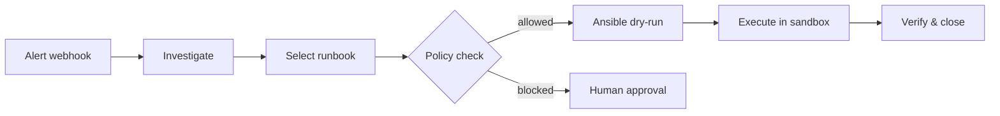

# Runbook Agent

**An open-source, bounded AI agent for Kubernetes incident triage and Ansible remediation.**

Runbook Agent is a phased personal R&D project by [Asif Draxi](https://asifad.github.io) — a Site Reliability Engineer building the public proof of production-grade agentic systems: structured outputs, eval-gated CI, policy boundaries, human-in-the-loop execution, and OpenTelemetry observability.

## What it does



| Stage | Description |
|-------|-------------|
| **Ingest** | Mock PagerDuty / New Relic alert JSON via FastAPI webhook |
| **Investigate** | Agent uses read-only `kubectl` + mock metrics to find root cause |
| **Decide** | Select remediation from an **approved runbook catalog** (YAML) |
| **Gate** | Policy engine blocks destructive or out-of-scope actions |
| **Execute** | Ansible playbooks run with `--check` by default; human approval for high-risk |
| **Verify** | Confirm pod health / endpoint recovery before closing the incident |

## Build approach

This project ships in **four internal phases**, published as **one monorepo** and **one portfolio story**:

| Phase | Name | Public? | Status |
|-------|------|---------|--------|
| 0 | Docs & scaffold | GitHub Pages live | **Complete** |
| 1 | Alert Classifier | Internal scaffold | Next |
| 2 | Incident Investigator | v0.1 publish | Planned |
| 3 | Runbook Agent (capstone) | v1.0 featured | Planned |
| 4 | Agent Ops Platform | v2 optional | Planned |

:::info Live docs

This site is hosted on GitHub Pages at **[asifad.github.io/runbook-agent](https://asifad.github.io/runbook-agent/)**.

:::

## Quick links

- [Project vision](./overview/project-vision) — goals and non-goals
- [System design](./architecture/system-design) — architecture diagrams
- [Tech stack](./tech-stack) — technologies and rationale
- [Roadmap timeline](./roadmap/timeline) — week-by-week plan
- [Phase 3 capstone](./phases/phase-3-runbook-agent) — the main deliverable

## Repository

```bash
git clone https://github.com/AsifAd/runbook-agent.git
cd runbook-agent
```

Code implementation begins in Phase 1. Documentation and project scaffolding ship first so every phase has a clear spec before a line of agent code lands.
