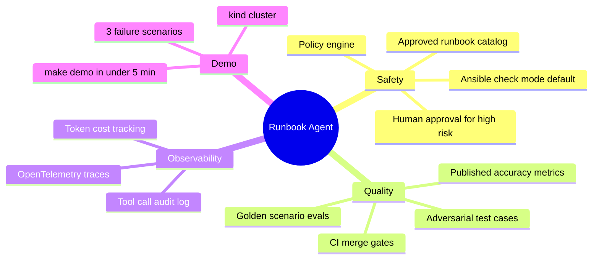

# Project Vision

## Mission

Build a **credible, open-source incident agent** that demonstrates how Site Reliability Engineers should treat AI in production: **bounded tools, eval regression gates, policy enforcement, and human approval** — not unbounded autonomy.

## The problem

Production SRE teams face a gap:

1. **Deterministic auto-healing** (alert → fixed playbook → Ansible) works for known failures but doesn't adapt to ambiguous signals.
2. **LLM chatbots** over infra are dangerous — arbitrary shell, no evals, no audit trail.
3. **Hiring managers** can't tell from a resume whether an engineer understands agent **safety** or just called an API.

Runbook Agent closes that gap with a demo you can run in 5 minutes and defend in a 45-minute interview.

## Connection to production work

This project is the **public, sanitized evolution** of real SRE work:

| Production (BlackLine) | Runbook Agent (OSS) |
|---------------------|---------------------|
| New Relic telemetry | Mock alert webhooks + OTel traces |
| PagerDuty incidents | Structured incident JSON |
| GitHub Actions triggers | FastAPI + CI eval harness |
| Ansible runbooks | Approved YAML catalog + `--check` default |
| On-call human judgment | Human-in-the-loop approval UI |

## Goals

## Non-goals

| Non-goal | Why |
|----------|-----|
| Fully autonomous production remediation | Liability; not how mature teams operate |
| RAG over random K8s docs | Runbooks are structured YAML, not embeddings |
| Multi-agent swarms | Complexity theater; hard to eval |
| Replacing on-call engineers | Decision support + bounded automation only |
| Exposing employer infrastructure | All demos run on local `kind` |

## Success criteria (v1)

- [ ] Public repo with architecture docs (this site)
- [ ] `make demo` brings up kind + fixes a CrashLoop scenario
- [ ] 15–20 golden eval scenarios with CI gate
- [ ] OTel trace screenshot in docs
- [ ] 3-minute demo video linked from README
- [ ] Featured on [asifad.github.io](https://asifad.github.io)
- [ ] Zero secrets, zero employer references

## Target audience

- **Recruiters / hiring managers** — one featured project proving AI + SRE depth
- **Platform / SRE engineers** — reference architecture for safe agent tooling
- **Future contributors** — phased specs before code lands
