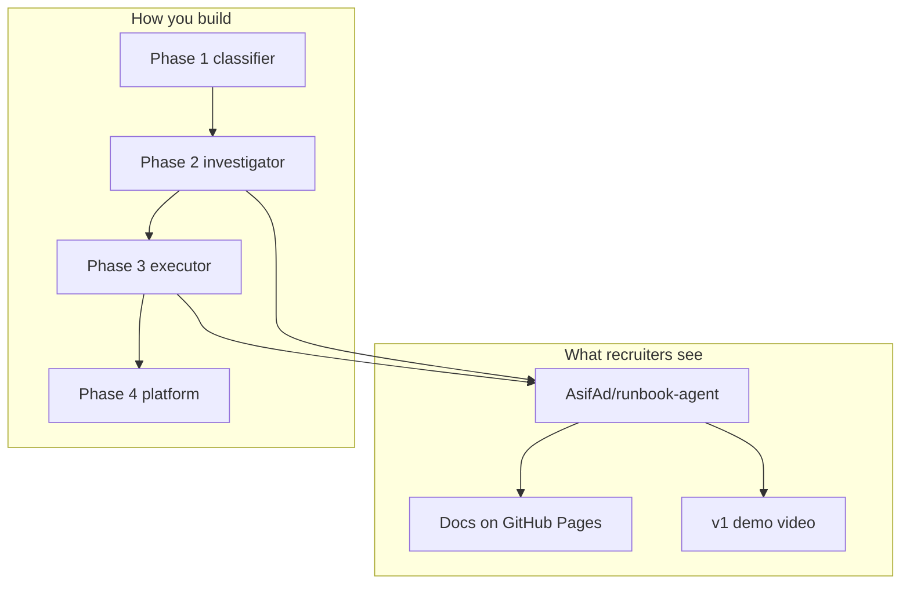

# Why This Project

## Portfolio gap analysis

[asifad.github.io](https://asifad.github.io) already demonstrates:

- **Production SRE impact** — 99.9% SLAs, $250K GCP savings, MTTR reduction
- **Deterministic auto-healing** — New Relic → PagerDuty → GitHub Actions → Ansible
- **Infrastructure depth** — Kubernetes, Terraform, Ansible, GitHub Actions
- **Open source credibility** — upstream PRs to Ansible, Argo CD, Jenkins

What's missing: **public proof of agentic AI engineering with SRE discipline**.

## Why not another tutorial project?

| Common AI project | Problem | Runbook Agent difference |
|-------------------|---------|--------------------------|
| "Chat with Kubernetes" | No guardrails, no evals | Bounded tools + policy layer |
| LangChain RAG bot | Unrelated to SRE workflow | Extends real auto-healing story |
| Multi-agent DevOps GPT | Can't demo or defend | Single agent, testable states |
| Copilot wrapper | No production thinking | OTel, CI evals, HITL approval |

## Why one repo, not four

Recruiters spend ~60 seconds on a project. They see:

1. One README
2. One demo link
3. One architecture diagram

Four small repos look like **experimentation**. One monorepo with phased docs (this site) shows **intentional architecture**.

## Interview narrative (30 seconds)

> "At work I built deterministic auto-healing — alerts trigger known Ansible runbooks. I asked where AI helps without becoming dangerous. Answer: triage and runbook **selection**, not arbitrary commands. Runbook Agent investigates with read-only tools, picks from an approved catalog, and only executes after policy checks and human approval — with CI evals that fail the build if the agent regresses."

## Resume bullet (when v1 ships)

> Built an open-source incident agent that investigates Kubernetes failures with read-only tools, selects remediations from an approved runbook catalog, and executes Ansible fixes only after policy checks and human approval — with CI-gated eval tests and OpenTelemetry tracing.
