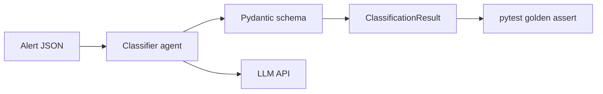

# Phase 1 — Alert Classifier

**Duration:** ~2 weeks · **Visibility:** Internal scaffold (not a separate public repo)

## Goal

Build the **classification + eval foundation** before any tool use or remediation. Prove the agent can reliably map alerts to incident types and runbook IDs using **structured JSON output only**.

## Why internal-only

A classifier without tools can look like a bootcamp project if published alone. Phase 1 exists to:

1. Create golden eval fixtures reused in Phases 2–4
2. Iterate on prompts with measurable accuracy
3. Define the runbook catalog schema

Recruiters see the output of Phase 1 inside Phase 3, not as a standalone repo.

## Architecture



## Deliverables

| Item | Path | Description |
|------|------|-------------|
| Classifier module | `packages/classifier/` | `classify(alert) → ClassificationResult` |
| Pydantic models | `packages/classifier/src/models.py` | Strict output schema |
| Prompt template | `packages/classifier/src/prompts/` | Version-controlled system prompt |
| Alert fixtures | `scenarios/*.json` | 5+ mock PagerDuty/NR alerts |
| Runbook catalog | `runbooks/catalog.yaml` | IDs, incident types, risk levels |
| Golden tests | `packages/classifier/tests/` | Expected runbook per fixture |
| CI workflow | `.github/workflows/ci.yml` | Fail PR if accuracy drops |

## Output schema

```python
class ClassificationResult(BaseModel):
    incident_id: str
    incident_type: str          # e.g. CrashLoopBackOff, OOMKilled
    severity: str
    confidence: float           # 0.0 – 1.0
    recommended_runbook_id: str # e.g. RB-003
    summary: str
    reasoning: str
```

## Tasks checklist

### Week 1
- [ ] Initialize `packages/classifier/` with `pyproject.toml`
- [ ] Define Pydantic input/output models
- [ ] Create 5 alert fixtures (CrashLoop, OOM, ImagePullBackOff, 502, disk pressure)
- [ ] Draft `runbooks/catalog.yaml` with 5 runbook entries
- [ ] Implement classifier with Pydantic AI or direct API call
- [ ] Write first 5 pytest golden tests

### Week 2
- [ ] Iterate prompt until ≥90% accuracy on golden set
- [ ] Add confidence threshold logic (escalate if &lt; 0.7)
- [ ] Add 3 edge-case fixtures (ambiguous alert, missing labels)
- [ ] Wire GitHub Actions CI
- [ ] Document prompt version in `CHANGELOG.md`

## Eval criteria

| Metric | Target |
|--------|--------|
| Golden accuracy | ≥ 90% (14/15 minimum) |
| p95 latency | &lt; 5 seconds |
| Structured output parse rate | 100% (no free-form fallback) |

## Sample fixture

```json
{
  "name": "crashloop-checkout-api",
  "input": {
    "id": "inc-001",
    "severity": "critical",
    "summary": "checkout-api CrashLoopBackOff",
    "labels": {
      "namespace": "shop",
      "pod": "checkout-api-7d4f8b9c-xk2lm",
      "alertname": "KubePodCrashLooping"
    }
  },
  "expected": {
    "incident_type": "CrashLoopBackOff",
    "recommended_runbook_id": "RB-001"
  }
}
```

## Exit gate → Phase 2

Phase 2 starts only when:

1. `make eval-classifier` passes locally
2. CI green on `main`
3. Runbook catalog schema is stable (no breaking changes expected)
