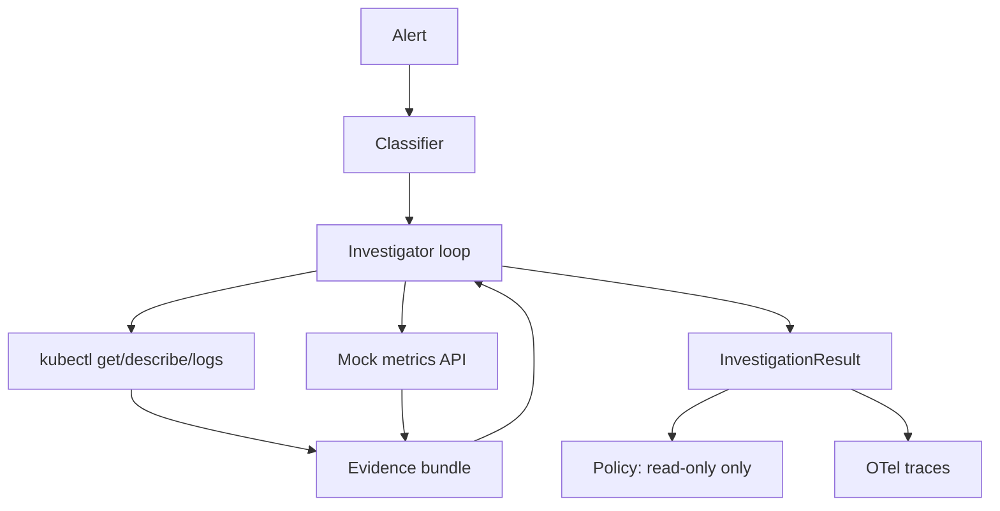
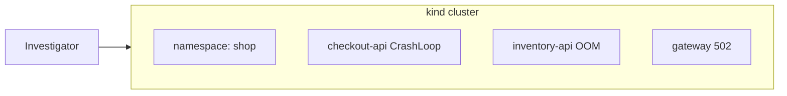

# Phase 2 — Incident Investigator

**Duration:** ~3 weeks · **Visibility:** v0.1 public publish

## Goal

Add **read-only tool use** and a **multi-step agent loop** that investigates Kubernetes failures on a local `kind` cluster and produces a root cause hypothesis with evidence — still **no remediation execution**.

This is the **minimum viable public project**: demo-able, testable, and credibly SRE.

## Architecture



## Deliverables

| Item | Path | Description |
|------|------|-------------|
| kind config | `infra/kind/kind-config.yaml` | Local 1-node cluster |
| Broken workloads | `infra/k8s/` | CrashLoop, OOM, bad ConfigMap |
| kubectl tool wrapper | `packages/investigator/src/tools/kubectl.py` | Allowlisted read-only commands |
| Metrics mock | `packages/investigator/src/tools/metrics.py` | Fake latency/error rate API |
| Policy middleware | `packages/investigator/src/policy.py` | Reject write/delete commands |
| Investigator agent | `packages/investigator/src/agent.py` | Pydantic AI tool loop |
| OTel integration | `packages/investigator/src/telemetry.py` | Spans per tool call |
| Golden tests | `packages/investigator/tests/` | Root cause + evidence assertions |

## Demo failure scenarios

| Scenario | K8s manifest | Root cause | Evidence |
|----------|-------------|------------|----------|
| **CrashLoop** | Bad container command | App exits immediately | `kubectl logs` shows error |
| **OOMKill** | Memory limit 128Mi | Java heap OOM | `describe` shows OOMKilled |
| **Bad ConfigMap** | Wrong API URL | App returns 502 | Logs show connection refused |



## Tool allowlist

| Tool | Commands allowed | Blocked |
|------|-----------------|---------|
| `kubectl_get` | `get pods,deployments,events` | — |
| `kubectl_describe` | `describe pod,deployment` | — |
| `kubectl_logs` | `logs --tail=100` | — |
| `kubectl_write` | — | `apply`, `delete`, `patch`, `scale` |
| `metrics_query` | `GET /metrics?service=X` | — |

## Output schema

```python
class InvestigationResult(BaseModel):
    incident_id: str
    incident_type: str
    root_cause: str
    confidence: float
    recommended_runbook_id: str
    evidence: list[str]
    tool_calls: list[ToolCallRecord]
```

## Tasks checklist

### Week 3
- [ ] kind cluster setup + `make cluster-up`
- [ ] Deploy 3 broken workloads
- [ ] Implement kubectl tool wrapper with allowlist
- [ ] Implement mock metrics API
- [ ] Policy middleware rejects write operations

### Week 4
- [ ] Wire classifier → investigator pipeline
- [ ] Pydantic AI agent loop (observe → tool → observe → conclude)
- [ ] 10 golden scenario tests
- [ ] OpenTelemetry spans exported to console / Grafana

### Week 5
- [ ] 3 adversarial scenarios (misleading logs, wrong pod name)
- [ ] Grafana dashboard screenshot
- [ ] `make demo-investigate` target
- [ ] Git tag `v0.1.0`
- [ ] Portfolio "in progress" card

## Eval criteria

| Metric | Target |
|--------|--------|
| Root cause accuracy | ≥ 80% (8/10) |
| Forbidden tool calls | 0 (hard fail) |
| p95 investigation time | &lt; 60 seconds |
| OTel span coverage | 100% of tool calls |

## Exit gate → Phase 3

1. `make demo-investigate` works for CrashLoop scenario
2. Zero forbidden tool calls in eval suite
3. OTel traces visible in Grafana or console exporter

See [Phase Testing Gates](../evals/phase-testing-gates#phase-2--incident-investigator) for full test suite, stage checks, and rollback points.
