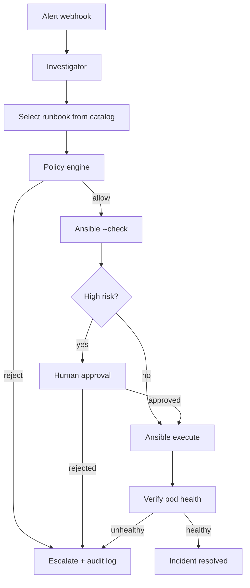
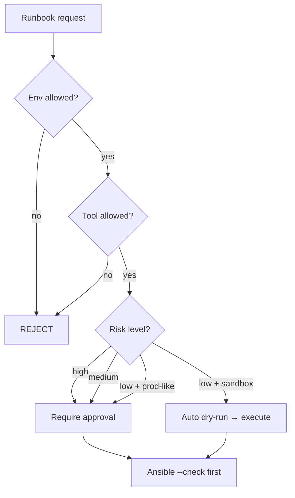

# Phase 3 — Runbook Agent (Capstone)

**Duration:** ~5 weeks · **Visibility:** v1.0 — **featured portfolio project**

## Goal

Complete the full incident loop: **investigate → select runbook → policy check → Ansible dry-run → human approve → execute → verify**. This is the project you lead with in interviews and on [asifad.github.io](https://asifad.github.io).

## Architecture

## Deliverables

| Item | Path | Description |
|------|------|-------------|
| Executor module | `packages/executor/` | Full remediation pipeline |
| FastAPI webhook | `packages/executor/src/api.py` | `POST /webhooks/alert` |
| Policy engine | `packages/executor/src/policy.py` | Runbook + env + risk checks |
| Ansible integration | `packages/executor/src/ansible.py` | `--check` default, timeout |
| Approval endpoint | `packages/executor/src/api.py` | `POST /incidents/{id}/approve` |
| Playbooks | `runbooks/playbooks/` | 3+ remediation playbooks |
| Full eval suite | `scenarios/` | 15–20 golden + adversarial |
| Demo script | `Makefile` | `make demo` end-to-end |

## Runbooks (v1 minimum)

| ID | Name | Playbook | Risk | Approval |
|----|------|----------|------|----------|
| RB-001 | Rollback bad image | `rollback-image.yml` | medium | yes |
| RB-002 | Rollback ConfigMap | `rollback-configmap.yml` | medium | yes |
| RB-003 | Fix OOM — increase memory | `fix-oom.yml` | medium | yes |
| RB-004 | Fix image pull secret | `fix-imagepull.yml` | low | no (sandbox) |
| RB-005 | Scale replicas | `scale-up.yml` | low | no (sandbox) |

## Policy rules

| Rule | Action |
|------|--------|
| Runbook not in catalog | REJECT |
| Environment not in `allowed_envs` | REJECT |
| Agent calls forbidden tool | REJECT + CI test failure |
| `requires_approval: true` | Block until human approves |
| All executions | Ansible `--check` first |

## Tasks checklist

### Week 6–7
- [ ] Implement policy engine with catalog lookup
- [ ] Write 3 Ansible playbooks (CrashLoop, OOM, ConfigMap)
- [ ] Ansible runner with `--check` default + timeout
- [ ] Wire investigator → executor pipeline

### Week 8
- [ ] FastAPI webhook + approval endpoints
- [ ] Human approval flow (CLI or minimal UI)
- [ ] Post-remediation health verification
- [ ] Audit log (structured JSON to stdout / file)

### Week 9
- [ ] Expand to 15–20 golden eval scenarios
- [ ] 3 adversarial cases in CI
- [ ] `make demo` — full end-to-end under 5 minutes
- [ ] OTel dashboard: cost, latency, success rate

### Week 10
- [ ] 3-minute demo video
- [ ] Update portfolio site — **featured project**
- [ ] Resume bullet
- [ ] Git tag `v1.0.0`
- [ ] Blog post: "Why I didn't give my agent root"

## Eval criteria (v1 ship gate)

| Metric | Target |
|--------|--------|
| Runbook selection accuracy | ≥ 85% (17/20) |
| Forbidden action attempts | 0 |
| End-to-end demo success rate | 100% on 3 primary scenarios |
| Mean remediation time (sandbox) | &lt; 3 minutes |

## Interview demo script

1. `make cluster-up` — show broken checkout-api pod
2. `curl -X POST /webhooks/alert` — send CrashLoop fixture
3. Show agent investigation output + evidence
4. Show policy check + Ansible dry-run diff
5. Approve execution
6. `kubectl get pods` — pod Running
7. Show OTel trace in Grafana

**Total time:** under 5 minutes.

## Exit gate → Phase 4

Phase 4 is optional. v1.0 is the primary deliverable. Only proceed to Phase 4 if v1.0 is live and featured on portfolio.

See [Phase Testing Gates](../evals/phase-testing-gates#phase-3--runbook-agent-capstone) for full test suite, stage checks, and rollback points.
