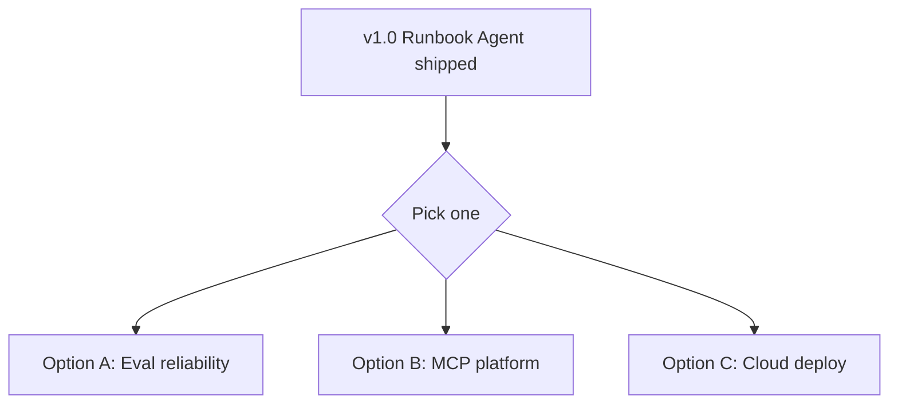
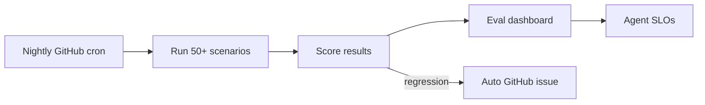
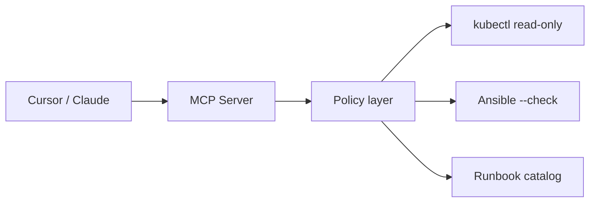
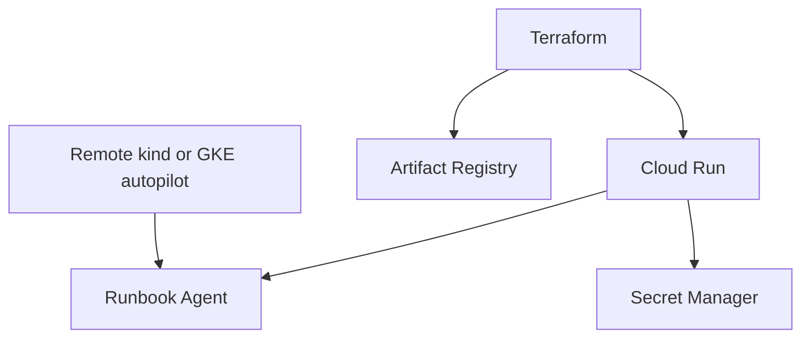

# Phase 4 — Agent Ops Platform

**Duration:** ~6–8 weeks · **Visibility:** v2.0 optional · **Only after v1.0 ships**

## Goal

Operate the agent like a **production service**: SLOs, nightly eval regression, cost tracking, and optional platform extensibility (MCP). This is Staff-level depth — valuable but **not required** for a strong portfolio.

## Pick one focus

Do not attempt all three. Choose based on target roles:

| Option | Best for | Effort |
|--------|----------|--------|
| **A — Eval-driven reliability** | SRE / reliability roles | Medium |
| **B — MCP tool server** | Platform / AI infra roles | Medium–High |
| **C — Cloud deploy (Terraform)** | GCP / platform roles | Medium |

---

## Option A — Eval-driven agent reliability

### Architecture

### Deliverables
- [ ] Expand scenarios to 50+ (include synthetic alert variations)
- [ ] Nightly eval workflow in GitHub Actions
- [ ] Eval results stored as JSON artifacts
- [ ] Simple dashboard (GitHub Pages or Grafana)
- [ ] Agent SLOs defined and tracked:
  - Runbook selection accuracy ≥ 95%
  - p95 triage latency &lt; 30s
  - Forbidden tool rate = 0%
  - Cost per incident &lt; $0.05
- [ ] Auto-file GitHub issue when SLO breached

### Why this matters
Shows you think about **AI system reliability** the same way you think about service reliability — SLOs, regression detection, automated escalation.

---

## Option B — MCP tool server

### Architecture

### Deliverables
- [ ] MCP server exposing safe infra tools
- [ ] Policy layer shared with Runbook Agent
- [ ] Documentation for Cursor / Claude Desktop integration
- [ ] Eval tests for MCP tool boundaries
- [ ] Published to GitHub with example config

### Why this matters
MCP is the emerging standard for agent tooling. Publishing a **safe infra MCP server** is rare and credible for platform engineering roles.

---

## Option C — Cloud deploy with Terraform

### Architecture

### Deliverables
- [ ] Terraform module: `platform/terraform/gcp/`
- [ ] Cloud Run service for agent API
- [ ] Secret Manager for LLM API key
- [ ] Remote demo environment (not laptop-only)
- [ ] Cost estimate documented (&lt; $10/month)

### Why this matters
Demonstrates GCP skills (Professional Cloud Architect cert) applied to AI workloads.

---

## Phase 4 non-goals

| Skip | Why |
|------|-----|
| Full autonomous remediation | Already rejected in v1 |
| Multi-agent orchestration | Complexity without eval benefit |
| Fine-tuning custom models | Out of scope for SRE portfolio |
| Replacing Phase 3 demo | v1 must remain the primary story |

## Exit criteria (v2.0)

- [ ] Chosen option fully implemented and documented
- [ ] Eval SLOs published in docs (Option A) OR MCP integration demo (Option B) OR cloud demo URL (Option C)
- [ ] Git tag `v2.0.0`
- [ ] Blog post on agent operations learnings

## Decision guide

| If your target role is… | Build |
|-------------------------|-------|
| SRE / on-call / reliability | Option A |
| Platform / developer experience | Option B |
| Cloud / GCP platform engineer | Option C |
| Job hunting in &lt; 2 months | **Skip Phase 4** — v1.0 is enough |

See [Phase Testing Gates](../evals/phase-testing-gates#phase-4--agent-ops-platform) for full test suite, stage checks, and rollback points.
