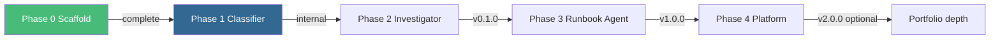

# Current Status

**Last updated:** 2026-05-21 · **Active phase:** Phase 1 — Alert Classifier

This page is the **single source of truth** for where the project stands. When in doubt, trust this page over older notes elsewhere in the docs.

## At a glance

| Item | Status |
|------|--------|
| **Phase** | Phase 1 — Alert Classifier (Week 1–2) |
| **Previous** | Phase 0 — Docs & scaffold ✅ |
| **Next gate** | `make eval-classifier` ≥ 90% golden accuracy |
| **Public tag** | None yet — first public tag at `v0.1.0` (Phase 2) |
| **Docs site** | [Live on GitHub Pages](https://asifad.github.io/runbook-agent/) |
| **Code** | Scaffold only — classifier implementation starting |

## This week (Phase 1, Week 1)

| # | Task | Spec | Done |
|---|------|------|------|
| 1 | Initialize `packages/classifier/` with `pyproject.toml` | [Phase 1](../phases/phase-1-classifier) | ☐ |
| 2 | Define Pydantic input/output models | [Phase 1](../phases/phase-1-classifier#output-schema) | ☐ |
| 3 | Load 5 alert fixtures from `scenarios/` | [Scenario matrix](./scenario-matrix) | ☐ |
| 4 | Implement classifier (Anthropic + Pydantic AI) | [ADR-001](../decisions/llm-provider) | ☐ |
| 5 | First 5 pytest golden tests | [Testing gates](../evals/phase-testing-gates#phase-1--alert-classifier) | ☐ |

## Phase progress

| Phase | Name | Visibility | Target | Status |
|-------|------|------------|--------|--------|
| **0** | Docs & scaffold | GitHub Pages | Week 0 | ✅ Complete |
| **1** | Alert Classifier | Internal | Week 2 | 🔵 In progress |
| **2** | Incident Investigator | `v0.1.0` | Week 5 | Planned |
| **3** | Runbook Agent | `v1.0.0` featured | Week 10 | Planned |
| **4** | Agent Ops Platform | `v2.0.0` optional | Week 16+ | Planned |

## Exit gates (what blocks the next phase)

| From → To | Gate | Command |
|-----------|------|---------|
| Phase 0 → 1 | Docs + E2E green | `cd website && npm run test:e2e` |
| Phase 1 → 2 | ≥ 90% golden accuracy; catalog schema frozen | `make eval-classifier` |
| Phase 2 → 3 | Investigation demo works; 0 forbidden tools | `make demo-investigate` |
| Phase 3 → 4 | Full demo + portfolio featured | `make demo` |

Full rollback and stage checks: [Phase Testing Gates](../evals/phase-testing-gates).

## Decisions locked

| Decision | Doc | Choice |
|----------|-----|--------|
| LLM provider (v1) | [ADR-001](../decisions/llm-provider) | Anthropic Claude (tool use + structured output) |
| Monorepo | [Why one repo](../overview/why-this-project) | Single repo, phased packages |
| Approval UX (v1) | [Phase 3](../phases/phase-3-runbook-agent) | FastAPI `POST /incidents/{id}/approve` — no UI until v2 |
| Demo environment | [Policy guardrails](../security/policy-guardrails) | `sandbox` only via kind |

## Open questions

| Question | Decide by | Notes |
|----------|-----------|-------|
| Prompt version tagging format | Phase 1 Week 2 | e.g. `classifier-v1` in audit log |
| Grafana Cloud vs local OTel | Phase 2 Week 4 | Free tier preferred for portfolio screenshots |
| Phase 4 option (A/B/C) | After v1.0 ships | Skip if job hunting in &lt; 2 months |

## If you need v1 faster

See the [accelerated 6-week path](../roadmap/timeline#if-actively-job-hunting-accelerated) — combine Phase 2 + 3, ship with 10 scenarios instead of 20.

## Related docs

- [Scenario matrix](./scenario-matrix) — alert → runbook mapping (canonical)
- [Milestones](../roadmap/milestones) — full checklists per phase
- [Timeline](../roadmap/timeline) — week-by-week schedule
- [CI & secrets](../evals/ci-and-secrets) — GitHub Actions setup
