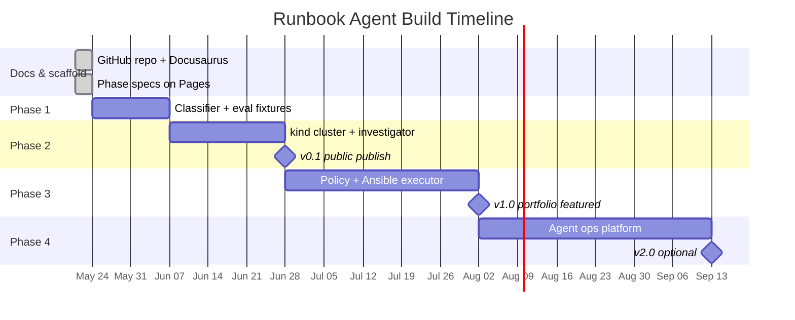
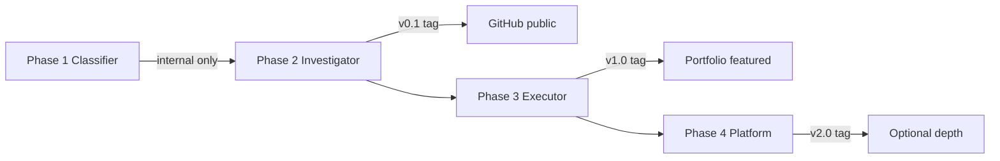

# Timeline

## Overall schedule (~10 weeks part-time)

Assumes **8–10 hours/week** alongside full-time SRE work.

## Week-by-week breakdown

| Week | Phase | Deliverables |
|------|-------|-------------|
| **W0** | Setup | GitHub repo, Docusaurus on Pages, monorepo scaffold, this docs site |
| **W1–2** | Phase 1 | 5 alert fixtures, runbook catalog YAML, classifier + pytest, ≥90% golden accuracy |
| **W3–4** | Phase 2 | kind cluster, 3 broken apps, read-only kubectl tools, investigator agent loop |
| **W5** | Phase 2 | OTel traces, adversarial evals, **v0.1 publish** to GitHub |
| **W6–7** | Phase 3 | Ansible playbooks, policy engine, `--check` default, 3 runbooks wired |
| **W8–9** | Phase 3 | Human approval flow, `make demo`, 15–20 golden scenarios, CI gate |
| **W10** | Phase 3 | Demo video, portfolio update, resume bullet — **v1.0 featured** |
| **W11+** | Phase 4 | Eval dashboard, MCP server, or Cloud Run deploy — optional |

## Phase → public visibility

| Milestone | Tag | Portfolio action |
|-----------|-----|-----------------|
| Docs live | — | Link from OSS hub |
| Phase 2 complete | `v0.1.0` | Add "in progress" project card |
| Phase 3 complete | `v1.0.0` | **Featured project** + resume bullet |
| Phase 4 complete | `v2.0.0` | Staff-level depth if needed |

## If actively job hunting (accelerated)

Skip publishing Phase 1 separately. Combine Phase 2 + 3 into a **6-week sprint**:

| Weeks | Focus |
|-------|-------|
| 1–2 | kind + investigator + 5 evals |
| 3–4 | Ansible executor + policy + 10 evals |
| 5–6 | Demo polish + portfolio + video |

Ship `v1.0.0` with fewer scenarios (10 instead of 20) rather than delay for perfection.
