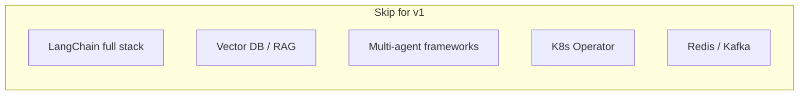

# Tech Stack

## v1 stack (ship first)

### Agent & application

| Technology | Version | Role | Why this choice |
|------------|---------|------|-----------------|
| **Python** | 3.11+ | Core language | Matches SRE tooling, Ansible ecosystem, agent libraries |
| **Pydantic AI** | latest | Agent loop + structured outputs | Cleaner than raw API calls; less magic than LangGraph |
| **FastAPI** | latest | Webhook + approval API | Lightweight, async, OpenAPI docs built-in |
| **Pydantic** | v2 | Schema validation | Structured agent outputs — non-negotiable for evals |
| **Anthropic Claude** | latest Sonnet | LLM provider (v1) | Tool use + structured output — see [ADR-001](./decisions/llm-provider) |

### Infrastructure & demo

| Technology | Role | Why |
|------------|------|-----|
| **kind** | Local Kubernetes | CI-friendly, free, industry standard |
| **kubectl** | Read-only agent tools | Real SRE workflow |
| **Plain K8s YAML** | Demo workloads (v1) | Faster than Helm for 3 scenarios |
| **Docker** | kind node runtime | Required by kind |

### Remediation

| Technology | Role | Why |
|------------|------|-----|
| **Ansible** | Runbook execution | Matches production auto-healing story |
| **YAML catalog** | Runbook definitions | Structured, git-reviewed, no RAG needed |

### Quality

| Technology | Role | Why |
|------------|------|-----|
| **pytest** | Unit + eval tests | Standard Python testing |
| **Golden fixtures** | Regression scenarios | Proves agent reliability |
| **GitHub Actions** | CI/CD | Already on resume; free for public repos |

### Observability

| Technology | Role | Why |
|------------|------|-----|
| **OpenTelemetry (Python SDK)** | Distributed tracing | SRE-grade; not AI-only tooling |
| **Grafana Cloud** | Dashboards (free tier) | Portfolio screenshots |

### Documentation & delivery

| Technology | Role | Why |
|------------|------|-----|
| **Docusaurus** | Docs site | This site — versioned, searchable, Mermaid support |
| **GitHub Pages** | Hosting | Free, auto-deploy on push |
| **Make** | Developer UX | `make demo`, `make eval` |

## v2 stack (after v1 ships)

| Technology | When | Purpose |
|------------|------|---------|
| **Helm** | v2 | Package demo charts if scenarios grow |
| **OPA / Rego** | v2 | Production-grade policy enforcement |
| **Next.js** | v2 | Human approval UI |
| **SQLite** | v2 | Audit log / run history |
| **Terraform** | v2 | Deploy to GCP Cloud Run |
| **MCP** | v2/v4 | Expose safe tools as MCP server |
| **LangSmith / Phoenix** | v2 | Eval trend tracking over time |

## Deliberately excluded (v1)

| Excluded | Reason |
|----------|--------|
| LangChain (full) | Too much abstraction; LangGraph optional only if needed |
| RAG / vector DB | Runbooks are structured YAML |
| CrewAI / AutoGen | Hard to eval; hype-heavy |
| Kubernetes Operator | Overkill for demo |
| Real PagerDuty / New Relic | Mock webhooks sufficient |

## Stack decision matrix

| If you need… | Use | Not |
|--------------|-----|-----|
| Structured LLM output | Pydantic AI + Pydantic | Free-form chat |
| Multi-step agent | Pydantic AI tool loop | 5-agent swarm |
| Policy enforcement | Python policy layer → OPA v2 | Prompt-only "be safe" |
| K8s demo | kind + YAML | EKS/GKE costs |
| Remediation | Ansible `--check` default | Raw `kubectl delete` |
| Eval confidence | pytest golden tests | Manual "it seems fine" |
| Observability | OpenTelemetry | Logs-only debugging |

## Cost estimate

| Item | Monthly cost |
|------|-------------|
| LLM API (dev + eval runs) | $5–20 |
| GitHub + Pages + Actions | $0 |
| kind + Docker | $0 |
| Grafana Cloud free tier | $0 |
| GCP Cloud Run (optional v2) | $0–5 |

## One-line summary

> **Python · Pydantic AI · FastAPI · kind · kubectl · Ansible · pytest · OpenTelemetry · Grafana · GitHub Actions · Docusaurus**
